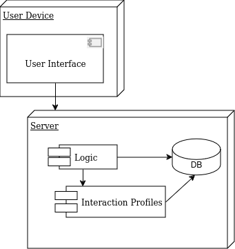
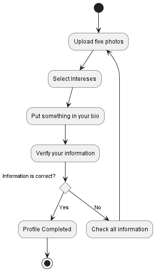
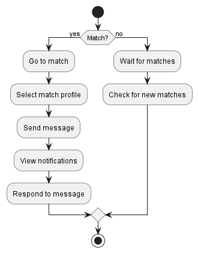
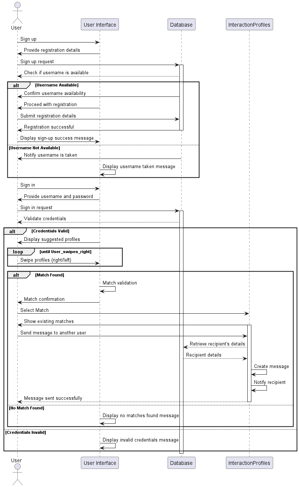
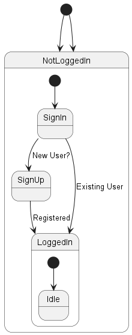
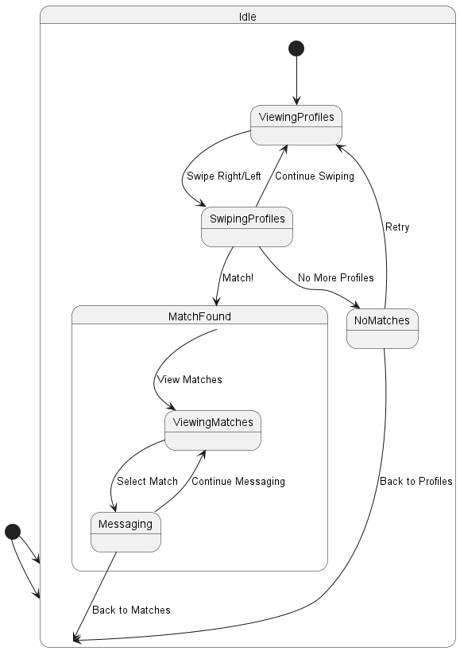
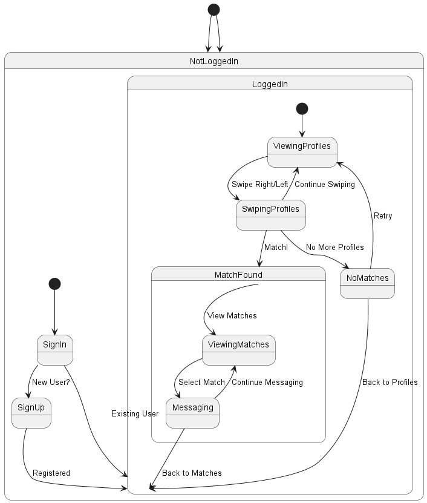
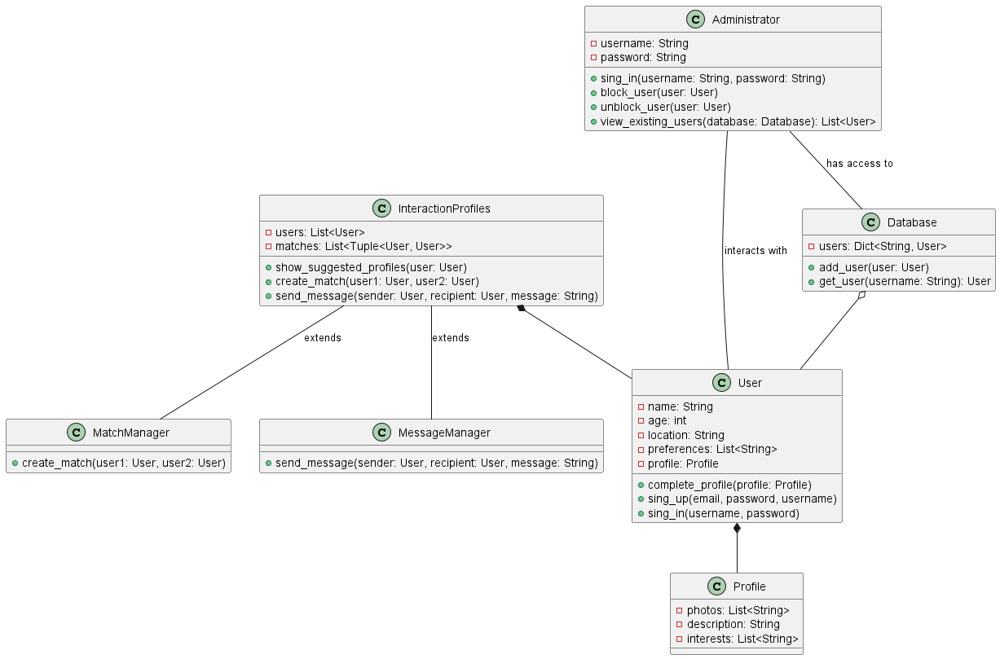
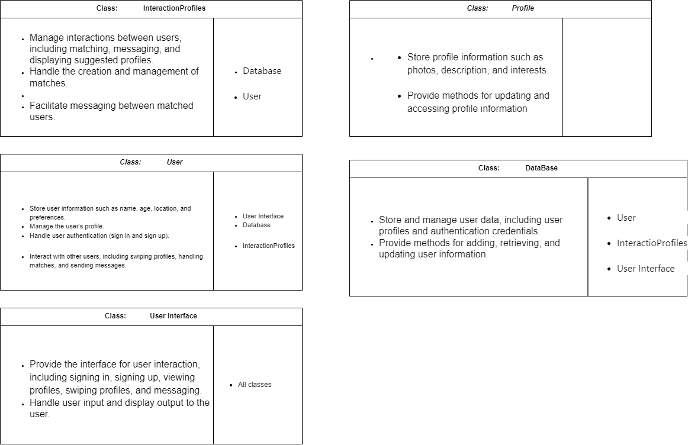

# Welcome to UDinder!
1. [About](#about-udinderfinal_project)
2. [Develop_process](#user-stories)
3. [Diagrams](#diagrams)
    - [Deployment Diagram](#deployment-diagram)
    - [Activity Diagram](#activity-diagrams)
    - [Sequence Diagram](#sequence-diagram)
    - [State Diagram](#state-diagrams)
    - [Class Diagram](#class-diagram)
    - [CRC cards](#crc-cards)
   
4. [Poster(Beta)](#poster)
5. [Paper](#paper)
6. [Technical Report](#technical-report)

## About UDinder(Final_project):
The project involves creating a monolithic software for an online platform. In terms of technical decisions, the project focused on key processes such as sign-in, sign-up, authentication, profile completion, and interaction with other user profiles.

Backend development was carried out using Python, leveraging the FastAPI framework. For the frontend graphical interface, HTML, CSS, and JavaScript were chosen, along with the Apache server and the Django framework.

For managing the database, SQLAlchemy was selected due to its ability to handle database relationships with a syntax similar to that of the programming language.

## Process Of Development
Firts, we create the UML diagrams of __Deployment__,__Activities__, __Sequence__, __State__, __Class__ and the __CRC__ cards of each class. 

## User Stories:

- **As a user**, I want to be able to sign up for the app so that I can create a profile and start using the platform.
- **As a developer**, I want to continuously monitor and improve the app's security to protect user data and privacy.
- **As an administrator**, I want to be able to access the database to view user information and activity for moderation purposes.
- **As a user**, I want to be able to sign in to the app with my username and password so that I can access my profile and interact with other users.
- **As an administrator**, I want to be able to block or suspend users who violate the app's community guidelines or terms of service.
- **As a developer**, I want to implement user authentication functionality to allow users to sign up and sign in securely.
-**As a user**, I want to be able to view suggested profiles so that I can find potential matches.
- **As a user**, I want to be able to swipe right or left on profiles to indicate my interest or disinterest.
- **As an administrator**, I want to be able to review reported profiles and messages to ensure they comply with the app's policies.
- **As a developer**, I want to implement profile management features to allow users to update their profiles and preferences.
- **As a user**, I want to receive notifications when I have a match with another user so that I can start messaging them.
- **As a developer**, I want to implement the matching algorithm to suggest compatible profiles to users.
- **As a developer**, I want to implement the messaging functionality to allow users to communicate with their matches.
- **As a user**, I want to be able to send messages to my matches to start a conversation and get to know them better.
- **As a user**, I want to be able to view my matches and their profiles so that I can keep track of my interactions.
- **As an administrator**, I want to be able to respond to user inquiries and provide assistance with any issues they may encounter.
- **As a developer**, I want to implement a reporting system to allow users to report inappropriate behavior or content.
- **As a developer**, I want to optimize the app's performance and scalability to handle a large number of users and interactions.

## Diagrams
### Deployment Diagram

### Activity Diagrams
- 
- 
- 
- 
- 
- 

### Sequence Diagram
- 

### State Diagrams
- 
- 
- 

### Class Diagram
- 

### CRC cards
- 
- 
- 
- 
- 
- 

## Poster

## Paper

## Technical Report
<!-- " -->
